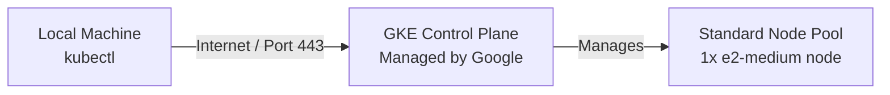

# Section 3: Provisioning a Managed GKE Cluster with Terraform for CKAD Practice

Welcome to Section 3 of the Kubernetes Scaling Workshop! 

If you are preparing for the **CKAD (Certified Kubernetes Application Developer)** exam, you do not need to know how to install Kubernetes components (like `kubeadm`, `kubelet`, or `containerd`) from scratch. Instead, you need a functional, standard Kubernetes cluster where you can practice deploying pods, managing configurations, setting up network policies, and troubleshooting applications.

In this guide, we will use **Terraform** to provision a minimal, highly cost-effective **Google Kubernetes Engine (GKE)** cluster on GCP, and configure your local machine to connect to it.

---

## 🏛️ Architecture Overview

Managed GKE clusters handle the complex control plane (API Server, scheduler, etcd) automatically, allowing us to deploy a simple, single-node cluster to minimize cloud costs.



*   **GKE Control Plane**: Managed by Google (free of charge for one zonal cluster per billing account).
*   **Standard Node Pool**: A single worker node of machine type `e2-medium` (2 vCPUs, 4GB RAM) running on standard on-demand VMs to ensure maximum stability and prevent preemptive terminations during the workshop.

---

## 🛠️ Step 1: Install Required Tools on Your Local Machine

To deploy the cluster and interact with it, you need three tools installed on your local computer:
1.  **Terraform**: To provision the GKE infrastructure.
2.  **gcloud CLI**: To authenticate and manage GCP resources.
3.  **kubectl**: The official Kubernetes command-line tool.

### 1.1 Install Terraform

#### 🍎 macOS (Using Homebrew)
If you don't have Homebrew, install it from [brew.sh](https://brew.sh). Then run:
```bash
brew tap hashicorp/tap
brew install hashicorp/tap/terraform
```

#### 🪟 Windows (Using Winget)
Open PowerShell as Administrator and run:
```powershell
winget install HashiCorp.Terraform
```

#### 🐧 Linux (Debian/Ubuntu)
```bash
wget -O- https://apt.releases.hashicorp.com/gpg | sudo gpg --dearmor -o /usr/share/keyrings/hashicorp-archive-keyring.gpg
echo "deb [signed-by=/usr/share/keyrings/hashicorp-archive-keyring.gpg] https://apt.releases.hashicorp.com/gpg $(lsb_release -cs) main" | sudo tee /etc/apt/sources.list.d/hashicorp.list
sudo apt-get update && sudo apt-get install terraform
```

---

### 1.2 Install Google Cloud SDK (gcloud CLI)

#### 🍎 macOS
```bash
brew install --cask google-cloud-sdk
```

#### 🪟 Windows
Download and run the [Google Cloud CLI Installer](https://dl.google.com/dl/cloudsdk/channels/rapid/GoogleCloudSDKInstaller.exe).

#### 🐧 Linux
```bash
curl https://sdk.cloud.google.com | bash
exec -l $SHELL
```

---

### 1.3 Install kubectl

#### 🍎 macOS
```bash
brew install kubectl
```

#### 🪟 Windows
```powershell
winget install Kubernetes.kubectl
```

#### 🐧 Linux
```bash
sudo apt-get update && sudo apt-get install -y apt-transport-https ca-certificates curl gpg
sudo mkdir -p /etc/apt/keyrings
curl -fsSL https://pkgs.k8s.io/core:/stable:/v1.30/deb/Release.key | sudo gpg --dearmor -o /etc/apt/keyrings/kubernetes-apt-keyring.gpg
echo 'deb [signed-by=/etc/apt/keyrings/kubernetes-apt-keyring.gpg] https://pkgs.k8s.io/core:/stable:/v1.30/deb/ /' | sudo tee /etc/apt/sources.list.d/kubernetes.list
sudo apt-get update && sudo apt-get install -y kubectl
```

---

## ☁️ Step 2: Set Up Your GCP Project and Authenticate

### 2.1 Prepare Your GCP Project
1.  Log in to the [GCP Console](https://console.cloud.google.com/).
2.  Create a new project (e.g. `ckad-practice-lab`) and write down the **Project ID** (e.g. `ckad-practice-lab-451234`).
3.  Ensure billing is active for your project.
4.  Enable the **GKE API**:
    *   Search for **Google Kubernetes Engine API** in the Console and click **Enable**.
    *   *Alternatively*, run this command in your local terminal:
        ```bash
        gcloud services enable container.googleapis.com --project="YOUR_PROJECT_ID"
        ```

### 2.2 Authenticate Terraform with GCP
Instead of managing credential files and downloading JSON keys, we will authenticate using **Application Default Credentials (ADC)**. This safely authorizes Terraform to run using your standard user login.

Run the following command:
```bash
gcloud auth application-default login
```
This will open your web browser. Log in using your Google account and grant permissions.

---

## 🚀 Step 3: Provision the GKE Cluster

1.  Open your terminal and navigate to the Terraform directory:
    ```bash
    cd "section 3/terraform"
    ```
2.  Copy the example variables file:
    ```bash
    cp terraform.tfvars.example terraform.tfvars
    ```
3.  Open `terraform.tfvars` in your editor and input your Project ID:
    ```hcl
    # terraform.tfvars
    gcp_project_id = "ckad-practice-lab-451234"
    gcp_region     = "us-central1"
    gcp_zone       = "us-central1-a"
    ```
4.  Initialize Terraform:
    ```bash
    terraform init
    ```
5.  Generate the deployment plan:
    ```bash
    terraform plan
    ```
6.  Apply the configuration (type `yes` when prompted):
    ```bash
    terraform apply
    ```

It will take about **5 to 8 minutes** for Google Cloud to provision the network, control plane, and GKE nodes. Once completed, Terraform will display output similar to this:

```text
Apply complete! Resources: 4 added, 0 changed, 0 destroyed.

Outputs:
cluster_endpoint = "34.135.48.10"
cluster_name = "ckad-cluster"
kubeconfig_command = "gcloud container clusters get-credentials ckad-cluster --zone us-central1-a --project ckad-practice-lab-451234"
```

---

## 🔑 Step 4: Retrieve Your Kubeconfig

The `kubeconfig` is a configuration file (`~/.kube/config`) that contains credentials, endpoints, and contexts used by your local `kubectl` client to securely communicate with the Kubernetes cluster.

### 4.1 Download the Cluster Credentials
Run the helper command returned in the Terraform outputs (replace with your output values if they differ):

```bash
gcloud container clusters get-credentials ckad-cluster --zone us-central1-a --project YOUR_PROJECT_ID
```

#### What does this command do?
1.  Queries Google Cloud APIs for the public endpoints and TLS certificate authority details of the GKE cluster.
2.  Downloads these details onto your local machine.
3.  Inserts a new configuration block (context) into your local `~/.kube/config` file.
4.  Sets your local terminal's default Kubernetes context to the newly created GKE cluster.

---

## 🔍 Step 5: Verify Cluster Connectivity

Now you can test connection using standard `kubectl` commands.

1.  **Check Cluster Information**:
    ```bash
    kubectl cluster-info
    ```
    *This should output details about the active Kubernetes control plane.*

2.  **List Deployed Nodes**:
    ```bash
    kubectl get nodes
    ```
    *You should see a single node listed in the `Ready` status:*
    ```text
    NAME                                           STATUS   ROLES    AGE     VERSION
    gke-ckad-cluster-ckad-node-pool-e4f0d611-1jkw   Ready    <none>   3m15s   v1.30.1-gke.1156000
    ```

3.  **Practice Deployment (CKAD Test)**:
    Let's run a quick deployment to verify everything works properly:
    ```bash
    # Spin up an Nginx Pod
    kubectl create deployment nginx-practice --image=nginx

    # Verify that the Pod transitions to 'Running'
    kubectl get pods

    # Clean up the practice deployment
    kubectl delete deployment nginx-practice
    ```

You are now ready to run and practice any CKAD questions, deployments, network policies, or configurations!

---

## 🗑️ Step 6: Teardown and Cleanup

To prevent GCP from billing your account for resources after you are done practicing:

1.  Return to the Terraform directory:
    ```bash
    cd "section 3/terraform"
    ```
2.  Run the destroy command:
    ```bash
    terraform destroy
    ```
3.  Type `yes` to confirm deletion. All resources (GKE cluster, Node pool, VPC, Subnets) will be safely deleted.
