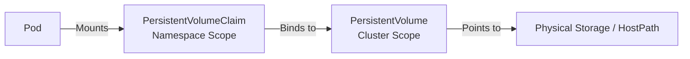

# Section 5: Application Config, Persistent Storage, and Stateful Workloads

Welcome to Section 5 of the Kubernetes Scaling Workshop! 

This section covers core topics required for the **CKAD (Certified Kubernetes Application Developer)** exam. We will master **ConfigMaps, Secrets, PersistentVolumes (PV), PersistentVolumeClaims (PVC), StorageClasses, and StatefulSets**.

In this guide, we will focus heavily on **describing resources** to understand their detailed characteristics, comparing **desired state** with **deployed state**, and verifying storage persistence across Pod restarts and scaling events.

---

## 📦 Module 1: Managing Application Configuration (ConfigMaps & Secrets)

Applications require configuration settings (ports, database names) and credentials (passwords, tokens). In Kubernetes, we separate these from the application code.

### 1.1 ConfigMaps

A **ConfigMap** stores non-confidential key-value configuration data.

#### 1.1.1 ConfigMap Creation (Three Ways)

##### 1. The Imperative Way (From Literals)
Create a ConfigMap instantly by passing key-value pairs directly in the CLI:
```bash
kubectl create configmap app-config-literal \
  --from-literal=APP_COLOR=red \
  --from-literal=APP_MODE=production
```

##### 2. The Imperative Way (From Local Files)
Create a temporary file:
```bash
echo "theme=dark" > config.txt
echo "timeout=30" >> config.txt
```
Create a ConfigMap from that file. The key will be the filename, and the value will be the file content:
```bash
kubectl create configmap app-config-file --from-file=config.txt
rm config.txt # Clean up local file
```

##### 3. The Declarative Way (YAML Manifest)
Review the file [configmap.yaml](file:///Users/chasechristensen/scaling-the-kubernetes-mountain/section%205/manifests/configmap.yaml):
```yaml
apiVersion: v1
kind: ConfigMap
metadata:
  name: app-config
data:
  APP_COLOR: blue
  APP_MODE: interactive
  ui.properties: |
    color=blue
    size=12
    font=sans-serif
```
Deploy the manifest:
```bash
kubectl apply -f manifests/configmap.yaml
```

#### 1.1.2 Describing the ConfigMap Resource
To inspect the properties, data keys, and binary sizes of the ConfigMap, use `describe`:
```bash
kubectl describe configmap app-config
```
*Observe the output shows all keys (`APP_COLOR`, `APP_MODE`, and `ui.properties`) and their values or sizes.*

---

### 1.2 Secrets

A **Secret** stores sensitive information (passwords, API tokens). Secret values are Base64 obfuscated to prevent shoulder-surfing, though they are not fully encrypted on their own without KMS integration.

#### 1.2.1 Secret Creation (Two Ways)

##### 1. The Imperative Way (From Literals)
Create a generic secret:
```bash
kubectl create secret generic app-secret-literal \
  --from-literal=API_TOKEN=super-secret \
  --from-literal=DB_PASSWORD=admin123
```

##### 2. The Declarative Way (YAML Manifest)
Secret values in YAML **must** be Base64 encoded. Let's encode a secret values manually:
```bash
echo -n "super-secret-token" | base64
# Output: c3VwZXItc2VjcmV0LXRva2Vu
```
Review and deploy [secret.yaml](file:///Users/chasechristensen/scaling-the-kubernetes-mountain/section%205/manifests/secret.yaml):
```bash
kubectl apply -f manifests/secret.yaml
```

#### 1.2.2 Describing and Decoding Secrets
If you describe a Secret, the values are masked:
```bash
kubectl describe secret app-secret
```
*Note that the output lists the keys and sizes (e.g. `API_TOKEN: 18 bytes`) but hides the actual content to prevent leaks.*

To view and decode a Secret's contents:
```bash
# Retrieve base64 encoded data
kubectl get secret app-secret -o yaml

# Extract and decode the API_TOKEN value (essential CKAD skill!)
kubectl get secret app-secret -o jsonpath='{.data.API_TOKEN}' | base64 --decode
```

---

### 1.3 Injecting Configurations & Secrets into a Pod

We can inject ConfigMap and Secret data into containers either as **Environment Variables** or as **Mounted Files**.

Review and deploy [pod-config.yaml](file:///Users/chasechristensen/scaling-the-kubernetes-mountain/section%205/manifests/pod-config.yaml):
```bash
kubectl apply -f manifests/pod-config.yaml
```
Verify the Pod is running:
```bash
kubectl get pod pod-config-demo
```

#### 1.3.1 Verifying Environment Variables
Exec into the container and print the environment:
```bash
kubectl exec pod-config-demo -- env | grep -E "COLOR|MODE|SECRET_TOKEN"
```
*Verify that `COLOR=blue` and `MODE=interactive` (from ConfigMap) and `SECRET_TOKEN=super-secret-token` (from Secret) are successfully injected.*

#### 1.3.2 Verifying Mounted Volume Files
ConfigMaps and Secrets mounted as volumes appear as directories containing a file for each key.
```bash
# Inspect mounted ConfigMap
kubectl exec pod-config-demo -- cat /config/ui.properties

# Inspect mounted Secret files
kubectl exec pod-config-demo -- cat /secrets/DB_PASSWORD
```

#### 1.3.3 Pro-Tip: Memory-Backed Storage (`tmpfs`)
Kubernetes mounts Secrets inside the pod using **tmpfs** (RAM-backed, temporary filesystems). This ensures sensitive tokens are never written to the physical storage disk of the node VM.

Verify the filesystem type for `/secrets` inside the running container:
```bash
kubectl exec pod-config-demo -- df -hT /secrets
```
*Observe that the Type column displays **`tmpfs`**.*

---

## 💾 Module 2: Persistent Storage Fundamentals (PVs and PVCs)

Pods are ephemeral; if they die, their local filesystems are lost. To persist data, Kubernetes uses a decoupled architecture of **PersistentVolumes** (infrastructure storage) and **PersistentVolumeClaims** (user storage requests).



### 2.1 Storage Abstraction: PersistentVolume (PV)

A **PersistentVolume** is a cluster-wide storage asset provisioned by an administrator.

1.  Review and deploy [pv-static.yaml](file:///Users/chasechristensen/scaling-the-kubernetes-mountain/section%205/manifests/pv-static.yaml):
    ```bash
    kubectl apply -f manifests/pv-static.yaml
    ```
2.  Inspect the PV:
    ```bash
    kubectl get pv
    kubectl describe pv pv-static-demo
    ```
    *Observe that the Status is **`Available`** and the claim mapping is empty. PVs exist cluster-wide and are not bound to any namespace.*

---

### 2.2 Storage Request: PersistentVolumeClaim (PVC)

A **PersistentVolumeClaim** is a request for storage by a user. It acts like a "voucher" that searches the cluster for a PersistentVolume that matches its capacity and access mode.

1.  Review and deploy [pvc-static.yaml](file:///Users/chasechristensen/scaling-the-kubernetes-mountain/section%205/manifests/pvc-static.yaml):
    ```bash
    kubectl apply -f manifests/pvc-static.yaml
    ```
2.  Watch the PVC binding process:
    ```bash
    kubectl get pvc pvc-static-demo
    ```
    *Notice the status immediately transitions from `Pending` to **`Bound`**.*
3.  Check the PV status:
    ```bash
    kubectl get pv
    ```
    *The status of `pv-static-demo` has transitioned to **`Bound`**, showing it is claimed by the PVC.*

---

### 2.3 Deploying a Pod with Storage

1.  Review and deploy [pod-storage-static.yaml](file:///Users/chasechristensen/scaling-the-kubernetes-mountain/section%205/manifests/pod-storage-static.yaml):
    ```bash
    kubectl apply -f manifests/pod-storage-static.yaml
    ```
2.  Describe the Pod to verify the volume mount is active:
    ```bash
    kubectl describe pod pod-storage-static
    ```
    *Look at the `Volumes` block to see `data-vol` mapping back to your PVC.*

---

### 2.4 Persistence Test

Let's verify that data survives Pod deletion.

1.  Write a test file into the mounted directory (`/data`) of the container:
    ```bash
    kubectl exec pod-storage-static -- sh -c "echo 'Kubernetes Persistent Storage Test' > /data/test.txt"
    ```
2.  Delete the Pod:
    ```bash
    kubectl delete pod pod-storage-static
    ```
3.  Recreate the Pod:
    ```bash
    kubectl apply -f manifests/pod-storage-static.yaml
    ```
4.  Wait for it to transition to `Running`, then read the file from the new Pod:
    ```bash
    kubectl exec pod-storage-static -- cat /data/test.txt
    ```
    *Verify that you see: `Kubernetes Persistent Storage Test`. The storage persisted because it lives outside the Pod's lifecycle.*

---

## ⚡ Module 3: Dynamic Provisioning & Storage Topology

Static provisioning requires admins to manually create PVs beforehand. In modern cloud environments, we use **StorageClasses** to automatically provision PVs on demand.

### 3.1 Dynamic Provisioning

1.  Examine the available StorageClasses in your cluster:
    ```bash
    kubectl get storageclass
    ```
    *(In GKE, you will see a default StorageClass named `standard` with the provisioner `pd.csi.storage.gke.io`).*
2.  Describe the standard StorageClass:
    ```bash
    kubectl describe storageclass standard
    ```
3.  Review and deploy [pvc-dynamic.yaml](file:///Users/chasechristensen/scaling-the-kubernetes-mountain/section%205/manifests/pvc-dynamic.yaml):
    ```bash
    kubectl apply -f manifests/pvc-dynamic.yaml
    ```
4.  Monitor the PVC:
    ```bash
    kubectl get pvc pvc-dynamic-demo -w
    ```
    *(Depending on the cloud settings, the PVC may stay in the `Pending` status. This is because GKE defaults to delaying disk provisioning until a Pod requesting the storage is scheduled to a specific node zone).*

5.  Deploy the Pod to consume the dynamic storage:
    ```bash
    kubectl apply -f manifests/pod-storage-dynamic.yaml
    ```
6.  Observe the PVC transition to `Bound` and check the dynamically created PV:
    ```bash
    kubectl get pvc pvc-dynamic-demo
    kubectl get pv
    ```
    *(Google Cloud dynamically created a Persistent Disk in the background, bound it as a PV, and mounted it to your GKE node!)*

7.  Describe the PVC to see GKE's provisioning logs:
    ```bash
    kubectl describe pvc pvc-dynamic-demo
    ```

---

### 3.2 Access Modes

Kubernetes supports different access modes for volumes:
*   **`ReadWriteOnce` (RWO)**: The volume can be mounted as read-write by a single Node. (Standard block storage like GCE Persistent Disks).
*   **`ReadOnlyMany` (ROX)**: The volume can be mounted as read-only by many Nodes.
*   **`ReadWriteMany` (RWX)**: The volume can be mounted as read-write by many Nodes. (Required for shared filesystems, like Google Filestore or NFS, allowing multiple Pods on different VMs to read/write concurrently).

---

### 3.3 Storage Topology & Wait For First Consumer

Cloud disks are **zonal**. If a disk is provisioned in zone `us-central1-a`, and the Kubernetes scheduler places the Pod in zone `us-central1-b`, the Pod will fail to start (`Multi-Zone Mount Failure`).

#### The Solution: `volumeBindingMode: WaitForFirstConsumer`
Open your StorageClass description again:
```bash
kubectl get storageclass standard -o yaml
```
Look at **`volumeBindingMode: WaitForFirstConsumer`**. This parameter instructs Kubernetes to **not** provision the disk immediately when the PVC is created. Instead, it waits until the Pod is assigned a Node by the scheduler, and then provisions the volume in the exact same zone, ensuring locality and scheduling compatibility.

---

## 🏛️ Module 4: Stateful Workloads (StatefulSets)

Deployments are designed for stateless applications. For applications that require stable identities and dedicated, isolated storage (e.g. database replicas, Kafka clusters), we use **StatefulSets**.

### 4.1 Headless Services & StatefulSets

A StatefulSet requires a **Headless Service** (a Service with `clusterIP: None`) to handle DNS resolution for individual pods.

1.  Review and deploy the Headless Service [service-headless.yaml](file:///Users/chasechristensen/scaling-the-kubernetes-mountain/section%205/manifests/service-headless.yaml):
    ```bash
    kubectl apply -f manifests/service-headless.yaml
    ```
2.  Review and deploy the StatefulSet [statefulset.yaml](file:///Users/chasechristensen/scaling-the-kubernetes-mountain/section%205/manifests/statefulset.yaml):
    ```bash
    kubectl apply -f manifests/statefulset.yaml
    ```

---

### 4.2 Ordered Startup and Hostname Stability

1.  Watch the StatefulSet Pod creation sequence:
    ```bash
    kubectl get pods -l app=stateful-web -w
    ```
    *Notice the ordering: `web-0` is created first and must be fully Running/Ready before `web-1` starts provisioning. (StatefulSets build replicas sequentially).*

2.  Verify the stable Hostname inside the Pods:
    ```bash
    kubectl exec web-0 -- hostname
    kubectl exec web-1 -- hostname
    ```
    *(Unlike Deployments, which generate random hashes in pod names, StatefulSet pods maintain a stable index name (`web-0`, `web-1`) that persists across restarts).*

---

### 4.3 Stable DNS Resolution

Because we deployed a Headless Service, CoreDNS creates a direct A record for each individual Pod.

1.  Spin up a temporary busybox testing pod:
    ```bash
    kubectl run tmp-dns --image=busybox:1.36 --restart=Never -- sleep 3600
    ```
2.  Resolve the individual Pod DNS names:
    ```bash
    kubectl exec tmp-dns -- nslookup web-0.nginx-headless
    kubectl exec tmp-dns -- nslookup web-1.nginx-headless
    ```
    *Observe that each DNS query resolves directly to the unique IP address of that specific Pod.*

---

### 4.4 Dedicated Storage Persistence

A StatefulSet uses **`volumeClaimTemplates`** to dynamically provision a dedicated PVC for each Pod replica.

1.  View the dynamically generated PVCs:
    ```bash
    kubectl get pvc
    ```
    *Observe that Kubernetes created `www-web-0` and `www-web-1` respectively.*

2.  **Scale Down Experiment**:
    Scale the StatefulSet down to 0 replicas:
    ```bash
    kubectl scale statefulset web --replicas=0
    ```
    Verify the pods are terminated:
    ```bash
    kubectl get pods -l app=stateful-web
    ```
3.  Check the PVCs:
    ```bash
    kubectl get pvc
    ```
    *Note that the PVCs `www-web-0` and `www-web-1` **are still present and Bound**! Kubernetes purposefully does not delete volume claims during scale-downs to protect your data.*

4.  Scale the StatefulSet back up to 2:
    ```bash
    kubectl scale statefulset web --replicas=2
    ```
    Watch the pods recreate: they will bind to their exact matching historical volumes (`web-0` binds to `www-web-0`, `web-1` to `www-web-1`), recovering their state.

---

## 🧹 Cleaning Up

After completing this section, clean up all configuration, storage, and stateful resources:

```bash
kubectl delete -f manifests/
kubectl delete pod tmp-dns
kubectl delete pvc app-config-file app-config-literal 2>/dev/null || true
kubectl delete configmap app-config-file app-config-literal 2>/dev/null || true
kubectl delete secret app-secret-literal 2>/dev/null || true
```
