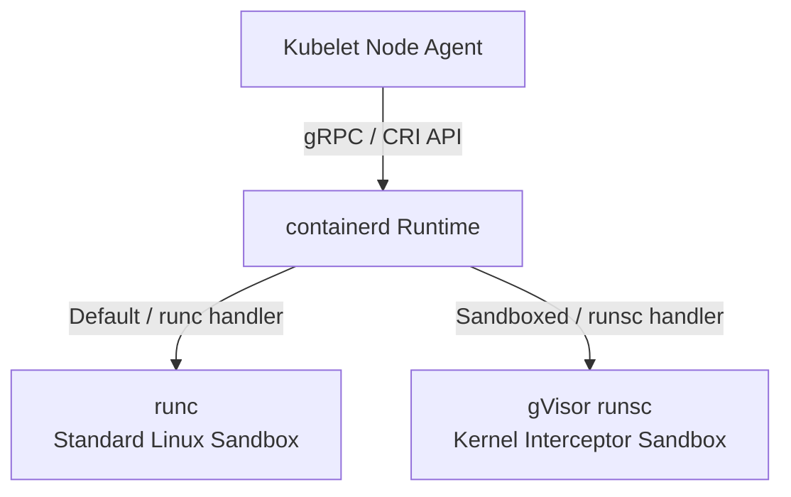

# Section 6: OCI Image Building, Registries, and Container Runtime Configuration

Welcome to Section 6 of the Kubernetes Scaling Workshop! 

This section covers critical **CKAD** syllabus areas: **container design, image building, registry usage, deployment security (digests), and container runtimes (RuntimeClasses)**.

In this guide, we will walk through:
1.  Building a secure, tiny container image using **Docker Multi-Stage Builds**.
2.  Pushing container images to **Docker Hub** and **Google Artifact Registry (GAR)**, and compiling in the cloud with **Google Cloud Build**.
3.  Deploying pods using **mutable tags** versus **immutable SHA256 content digests** to guarantee build reproducibility.
4.  Understanding the **Container Runtime Interface (CRI)** and declaring sandboxed runtimes using **`RuntimeClass`** resources.

---

## 📦 Module 1: Building a Reproducible OCI Image (Multi-Stage Builds)

When deploying applications to Kubernetes, container size and security are paramount. 
*   **Large containers** slow down Pod startup times because the node has to download gigabytes of data.
*   **Containers with compilers/shells** have a larger attack surface: if an attacker compromises your application, they can use built-in tools to compile malware or scan your network.

### 1.1 Multi-Stage Builds Theory
A **Multi-Stage Build** allows you to use multiple temporary `FROM` blocks in your Dockerfile.
1.  **Stage 1 (Builder)**: Uses a full-featured image containing compilers, package managers, and development tools to build your application binary.
2.  **Stage 2 (Runner)**: Starts from a completely fresh, minimal base image (like `alpine` or `scratch`) and copies *only* the compiled binary from the builder stage. All compiler dependencies are discarded.

---

### 1.2 Reviewing the Application
We will use a simple web application written in Go. Go is ideal because it compiles to a single, static executable binary.

1.  Review the application source code in [main.go](file:///Users/chasechristensen/scaling-the-kubernetes-mountain/section%206/app/main.go).
2.  Review the multi-stage [Dockerfile](file:///Users/chasechristensen/scaling-the-kubernetes-mountain/section%206/app/Dockerfile):

```dockerfile
# --- Stage 1: Build the static Go binary ---
FROM golang:1.22-alpine AS builder
WORKDIR /build
COPY main.go .
# Compile the binary as fully static (disable CGO, compile for linux)
RUN CGO_ENABLED=0 GOOS=linux go build -ldflags="-w -s" -o app main.go

# --- Stage 2: Deploy the binary in a minimal runtime environment ---
FROM alpine:3.19
WORKDIR /app
COPY --from=builder /build/app .
EXPOSE 8080
CMD ["./app"]
```

> [!TIP]
> The compile command uses `CGO_ENABLED=0`. This tells Go to build a completely self-contained binary with no dynamic linking to C libraries (such as `glibc`), allowing the binary to run on any base filesystem—even inside the empty `scratch` image!

---

### 1.3 Building the Image Locally
If you have Docker installed on your local machine, navigate to the app directory and build the image:

```bash
cd "section 6/app"
docker build -t ckad-app:1.0 .
```

*Verify the image size:*
```bash
docker images ckad-app:1.0
```
*Note that the final image is only around **15MB**, whereas the builder stage (`golang:alpine`) was over **800MB**!*

---

## 🚀 Module 2: Tagging and Pushing to Registries

To pull images inside GKE/Kubernetes, the image must reside in a registry. We will demonstrate Docker Hub, Google Artifact Registry, and Google Cloud Build.

### 2.1 Pushing to Docker Hub

1.  Log in to Docker Hub:
    ```bash
    docker login
    ```
2.  Tag your image with your Docker Hub username:
    ```bash
    docker tag ckad-app:1.0 YOUR_DOCKER_USERNAME/ckad-app:1.0
    ```
3.  Push the image:
    ```bash
    docker push YOUR_DOCKER_USERNAME/ckad-app:1.0
    ```

---

### 2.2 Pushing to Google Artifact Registry (GAR)

**Artifact Registry** is Google Cloud's fully managed registry service.

#### 1. Create a GAR Repository
Run this command to create a private Docker repository in your active GCP project (replace `YOUR_PROJECT_ID` with your project ID):
```bash
gcloud artifacts repositories create ckad-repo \
  --repository-format=docker \
  --location=us-central1 \
  --description="CKAD Docker Repository" \
  --project="YOUR_PROJECT_ID"
```

#### 2. Configure Docker Authentication
Configure your local Docker daemon to authenticate with GCP endpoints:
```bash
gcloud auth configure-docker us-central1-docker.pkg.dev
```

#### 3. Tag and Push the Image
```bash
# Tag format: REGION-docker.pkg.dev/PROJECT_ID/REPOSITORY/IMAGE_NAME:TAG
docker tag ckad-app:1.0 us-central1-docker.pkg.dev/YOUR_PROJECT_ID/ckad-repo/ckad-app:1.0

# Push
docker push us-central1-docker.pkg.dev/YOUR_PROJECT_ID/ckad-repo/ckad-app:1.0
```

---

### 2.3 Compiling in the Cloud: Google Cloud Build
What if your laptop doesn't have Docker installed? You can submit your source folder directly to **Google Cloud Build**, which compiles the Dockerfile inside Google's cloud runners and pushes the resulting image straight to your Artifact Registry repository.

From the `section 6/app` folder, run:
```bash
gcloud builds submit \
  --tag us-central1-docker.pkg.dev/YOUR_PROJECT_ID/ckad-repo/ckad-app:1.0 .
```

---

## 🔒 Module 3: Mutable Tags vs. Immutable Content Digests

When deploying Pods in Kubernetes, how you reference the image affects security and reproducibility.

### 3.1 Mutable Tags
A tag like `:1.0` or `:latest` is **mutable** (can change). If an developer pushes an updated container image using the same tag (`:1.0`), the registry updates the pointer.
*   **The Risk**: If your Kubernetes cluster nodes pull this image, some nodes may run the old version (if the image was cached locally and `imagePullPolicy` is set to `IfNotPresent`) while new nodes pull the new version. This leads to **deployment drift**.
*   **The Security Threat**: If an attacker compromises your registry, they could overwrite your tag with malicious code.

---

### 3.2 Immutable Content Digests (SHA256)
Every image build creates a unique cryptographic hash of its filesystem layers, known as a **digest**. The digest looks like `sha256:7ebe7d...` and is completely **immutable**. If a single bit in the container filesystem changes, the hash changes.

#### 1. Retrieve Your Image Digest
Inspect your pushed image locally to retrieve the SHA256 digest:
```bash
docker inspect --format='{{index .RepoDigests 0}}' ckad-app:1.0
```
*Alternatively, log in to the GCP Console (Artifact Registry) or Docker Hub web interface to copy the SHA256 hash.*

#### 2. Deploy Using a Tag (Mutable)
Open [pod-tag.yaml](file:///Users/chasechristensen/scaling-the-kubernetes-mountain/section%206/manifests/pod-tag.yaml) and update the `image` field to point to your registry path. Deploy the pod:
```bash
kubectl apply -f manifests/pod-tag.yaml
```

#### 3. Deploy Using a Digest (Immutable)
Open [pod-digest.yaml](file:///Users/chasechristensen/scaling-the-kubernetes-mountain/section%206/manifests/pod-digest.yaml). Update the image line, referencing the image name appended with `@sha256:<your-hash>`:
```yaml
spec:
  containers:
  - name: ckad-app
    image: us-central1-docker.pkg.dev/YOUR_PROJECT_ID/ckad-repo/ckad-app@sha256:e3b0c44298fc1c149afbf4c8996fb92427ae41e4649b934ca495991b7852b855
```
Deploy the pod:
```bash
kubectl apply -f manifests/pod-digest.yaml
```

#### 4. Verification
Inspect the running pods:
```bash
kubectl get pod ckad-app-digest -o jsonpath='{.status.containerStatuses[0].imageID}'
```
*Observe that even if you submitted the deployment referencing a tag, Kubernetes resolves it to the immutable digest (`docker-pullable://...`) to guarantee execution safety.*

---

### 3.3 Image Pull Policies

The **`imagePullPolicy`** field in your Pod specification determines when the node's container runtime (`containerd`) should pull the image from the registry versus using a locally cached image.

There are three available policies:

| Policy | Behavior | Default When |
| :--- | :--- | :--- |
| **`Always`** | Kubernetes checks the registry every time the Pod starts. It validates the registry's hash with the local cache; if a newer image exists, it downloads it. | Tag is `:latest` or omitted. |
| **`IfNotPresent`** | Kubernetes checks the local cache first. If the image is already on the node, it runs it immediately. It **only** pulls from the registry if the image is missing. | Tag is specific (e.g., `:1.0` or `:v2`). |
| **`Never`** | Kubernetes will **never** query the registry. It assumes the image is already pre-loaded on the node VM. | N/A |

#### 3.3.1 Setting the Policy in YAML
You define this under the container spec:
```yaml
spec:
  containers:
  - name: ckad-app
    image: YOUR_DOCKER_USER/ckad-app:1.0
    imagePullPolicy: Always # Options: Always, IfNotPresent, Never
```

#### 3.3.2 Hands-On: Testing the Policies

##### Test 1: Caching Behavior with `IfNotPresent`
1. Deploy a pod with a specific tag (e.g., `:1.0`). By default, GKE interprets this as `IfNotPresent`.
2. Delete and recreate the pod. Observe the start time is near-instant because the node skipped downloading the image layers from the registry.

##### Test 2: Overwriting Tags (The Danger of Mutable Tags + `IfNotPresent`)
1. Re-build your application with a slight change (e.g. edit `main.go` to print "Hello v2" instead) and push it under the **same tag** (`:1.0`).
2. Re-deploy the Pod. Because the node already has `:1.0` cached, and its policy is `IfNotPresent`, GKE **will not pull** the new image. Your Pod will run the old "v1" code, demonstrating the danger of tag mutation.

##### Test 3: Solving Drift with `Always`
1. Re-deploy the Pod, but set `imagePullPolicy: Always` in the spec.
2. Even though the node has `:1.0` cached, `containerd` queries the registry, realizes the SHA256 digest of `:1.0` in the registry is different, pulls the new image layers, and runs the new code.

##### Test 4: Testing `Never` (Failing when not cached)
1. Deploy a Pod with a non-existent image tag (e.g. `:99.0`) and set `imagePullPolicy: Never`.
2. Inspect the Pod state:
   ```bash
   kubectl get pods
   ```
   *Observe the Pod fails immediately with the status **`ErrImageNeverPull`** because the image does not exist locally on the node VM.*

---

## 🛡️ Module 4: Kubernetes Runtime Class & Container Runtimes (CRI)

The **Container Runtime Interface (CRI)** is the API standard that allows the Kubernetes `kubelet` agent on each node to communicate with the active container runtime (like `containerd`).



By default, containerd runs pods using **`runc`**, which isolates containers using standard Linux Namespaces and Cgroups. However, all containers on the node share the same host Linux Kernel. If a container breaks out (privilege escalation), it can compromise the whole node.

For untrusted workloads (e.g. user-submitted code in a workshop), we use sandboxed runtimes like **gVisor (`runsc`)** or **Kata Containers** (micro-VMs) to isolate the container from the host kernel.

---

### 4.1 Creating a RuntimeClass

A **RuntimeClass** resource defines a runtime handler configured inside containerd.

1.  Review and deploy [runtimeclass.yaml](file:///Users/chasechristensen/scaling-the-kubernetes-mountain/section%206/manifests/runtimeclass.yaml):
    ```bash
    kubectl apply -f manifests/runtimeclass.yaml
    ```
2.  Describe the RuntimeClass:
    ```bash
    kubectl describe runtimeclass gvisor
    ```
    *Observe that it binds to the `gvisor` handler.*

---

### 4.2 Deploying a Pod with Custom Runtime

To instruct containerd to run your container inside the sandbox, you add `runtimeClassName` to the Pod specification.

1.  Review and deploy [pod-runtimeclass.yaml](file:///Users/chasechristensen/scaling-the-kubernetes-mountain/section%206/manifests/pod-runtimeclass.yaml):
    ```bash
    kubectl apply -f manifests/pod-runtimeclass.yaml
    ```
2.  Verify the Pod starts:
    ```bash
    kubectl get pod nginx-gvisor
    ```
    
> [!WARNING]
> If your GKE cluster nodes do not have gVisor installed, the pod will remain in a `ContainerCreating` or `Failed` status with a `CreateContainerError` indicating the runtime handler is not supported.
> 
> To enable gVisor sandboxing in GKE Standard, you can enable **GKE Sandbox** on your node pool by running:
> ```bash
> gcloud container node-pools update ckad-node-pool \
>   --cluster=ckad-cluster \
>   --zone=us-central1-a \
>   --sandbox type=gvisor
> ```

---

### 4.3 Verifying Sandboxed Isolation

How do we check if gVisor is actually running the container? 
gVisor intercepts system calls and runs a user-space kernel named **Sentry**. If we execute `dmesg` or check kernel details, gVisor will return its custom boot log instead of the host node VM's logs.

Run this check:
```bash
kubectl exec nginx-gvisor -- dmesg
```
*If running in a gVisor sandbox, the boot log will explicitly display:*
`Gofer: Mounting...`
`Sentry: Starting sandboxed processes...`

---

## 🧹 Cleaning Up

After completing this section, clean up all sandbox and deployment resources:

```bash
kubectl delete -f manifests/
```
